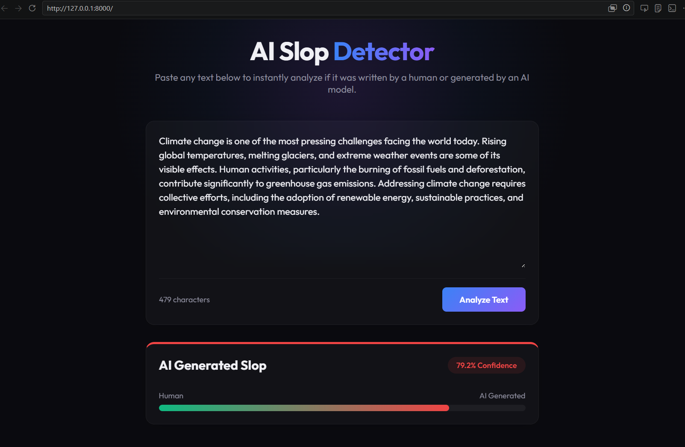

# SlopRadar
An end-to-end implementation for detection of AI-written text.



## Data
To train thr classifier, I needed many examples of human-written text and AI-generated text.
The dataset was created from scratch.

### Human-written text
We gathered examples of human-written text by scraping Wikipedia, wikinews and online books .
- Over 8000+ human written paragraph were scrapped as (traget was of 10k)
- The code for scraping is contained in `/scraping`
- The result is in `/scrapes`

### AI-generated text
AI text was then generated by running the scripts that first summarize and then rewrite the each paragraph.
- Generation was done using Groq (LLaMA 3) as it was cheap and API have higher request limit.
- Models were prompted to rewrite the text to accurately model real-world AI generation
- The code for data generation is contained in `/data-generation`

### Full dataset
The final dataset with 8k pairs of human-written and AI-generated text is uploaded on Hugging Face.
It can be found at: https://huggingface.co/datasets/sprakashx15/ai-slop-dataset
It can also be found at `/data/dataset.jsonl` in this repository.

## Model
Our model is a LoRA adapter of `bert-base-cased`, with a classification head.
By using the dataset we just hypertune the model with our dataset.
- Validation accuracy: 91.45%
- The code for training is contained in `/training`

## Usage
The final model weights are available on HuggingFace.
You can run the web interface locally to test the model:

```bash
pip install fastapi uvicorn torch transformers peft
uvicorn app.main:app --reload
```
Then navigate to `http://localhost:8000`.

## Benchmark Performance and Limitations
We test our model on the RAID benchmark training set to get a sense of the model's limitations.

### RAID Benchmark Performance
Our model performed better than random guessing across all model families tested, indicating that general, transferable properties of AI-generated writing were learned.
The TPR@FPR=1% for arXiv abstracts was 25.2%.
Text generated by conversational chat models (like mpt-chat and mistral-chat) was the most likely to be detected (50% to 74% TPR).
Base models that lack conversational RLHF tuning (like mistral or gpt2) were the hardest to detect.

The code and results for this analysis is contained in `/raid` and `/training/src/eval_raid.py`.

### Limitations
This model has several important limitations:

- Our dataset contains only Wikipedia-style text, assume Wikipedia is currently entirely human-generated.
- Our dataset contains only generations from LLaMA.
- The model has a context window of 512 tokens
- It was trained on one paragraph of text at a time.
